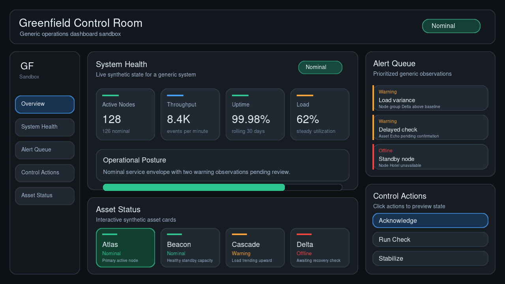

# Greenfield

Greenfield is an open-source, C++20, SDK-first creative application engine.

The Greenfield SDK is the reusable runtime and library that developers use to build creative applications. This repository is a monorepo for SDK/runtime code, future Greenfield Studio work, examples and sandbox apps, tools, docs, and tests.



## Current Scope

- SDL3 windowing and input through a small platform layer
- Renderer-agnostic render commands that keep UI code independent from backend details
- A current Dawn/WebGPU accelerated backend with clean ownership boundaries
- Explicit sandbox renderer selection for `--renderer=webgpu` and `--renderer=fast2d`
- A narrow Fast2D renderer backend foundation plus opt-in visible SDL CPU raster sandbox presentation
- M6E Fast2D visual parity foundation: source-over filled rectangles, hard-edged rectangular and rounded borders/fills, intersected nested clips, and stable first visible raster presentation
- UI widget, layout, input, text, and render command basics, including Button, Checkbox, Toggle/Switch, and Slider
- M6A UI runtime groundwork: renderer-neutral `UiId` identity, clearer per-frame versus persistent `UiContext` state, minimal focus state, active-control capture, and per-frame mouse press/release consumption
- M6B first stateful controls: validated Checkbox and added Toggle/Switch as immediate-mode controls backed by `UiId`-keyed persistent boolean state
- M6C first continuous/numeric stateful control foundation: private `UiId`-keyed numeric state and a horizontal immediate-mode Slider with renderer-neutral track/fill/thumb/label commands
- M6F keyboard/focus groundwork: platform-neutral keyboard edge input, immediate-mode focus traversal for Button, Checkbox, Toggle/Switch, and Slider, Tab / Shift+Tab traversal, and Enter/Space activation for focused Button, Checkbox, and Toggle/Switch
- Minimal SDK surface identity, root UI surface participation, and point-to-surface input routing
- CMake with Ninja presets
- vcpkg manifest-mode as the default dependency path
- Early M5 export/target vocabulary documentation and a minimal illustrative C++/CMake app-template scaffold, without install rules, packages, CLI behavior, or WASM implementation

## Direction

- `greenfield_render_fast2d` exists as a sibling backend target. It consumes renderer-neutral `RenderCommandList` commands, prepares backend-local fill operations, rasterizes deterministic filled rectangles with source-over alpha blending, hard-edged rectangular borders, hard-edged rounded fills, hard-edged rounded borders, and clipping into a CPU raster target, and defers text rasterization.
- Fast2D now handles intersected nested clips for its CPU raster path. Shape rasterization remains intentionally hard-edged and does not include antialiasing, vector paths, transforms, gradients, text, or full WebGPU visual parity.
- The single sandbox accepts `--renderer=webgpu` and `--renderer=fast2d` for side-by-side backend comparison without creating a second sandbox app.
- WebGPU remains the default interactive sandbox renderer.
- Fast2D is opt-in and visibly interactive in the sandbox through an SDL CPU raster presenter. The Fast2D SDL window is hidden until the first valid raster presentation so the first visible frame is stable. Text remains deferred in Fast2D, so the visible path shows stronger shape parity while labels and values remain visible only in the WebGPU path.
- The one-frame Fast2D diagnostic path remains available with `--renderer=fast2d --headless` or `--renderer=fast2d --diagnostic`.
- Renderer choice belongs in app/composition-root policy or narrow renderer-selection vocabulary, not in UI widgets, render commands, surface types, or platform abstractions.
- `greenfield_render_webgpu` is the current real WebGPU backend target, and `greenfield_webgpu` remains a compatibility alias.
- Dawn/WebGPU is the current implemented accelerated backend and should remain backend-specific in the architecture direction.
- The current default build still requires Dawn/WebGPU and FreeType because the sandbox still uses the WebGPU renderer.
- Skia may be considered later as an optional renderer/backend, but it is not the initial foundation.
- Greenfield Studio is a future IDE/editor built on top of the SDK, not part of current M4/M5 foundation work.
- Greenfield CLI is future tooling, not part of current M4/M5 foundation work.
- Development can be Linux-first for v0.1 work, while preserving Linux, Windows, and browser-hosted WebAssembly as v0.1 release/export architecture considerations.
- Exported Greenfield apps should be C++/CMake-based first.
- Exported apps are future app projects, not the sandbox copied as a product template.
- `apps/sandbox` is the current demo and composition root. Future exported apps should consume SDK/runtime targets and provide their own composition-root policy.
- `templates/cpp-cmake-app` is a minimal illustrative scaffold for that future exported-app shape. It is not included in the root build and is not a working export pipeline.
- A composition root may wire concrete host platform and renderer backend targets such as SDL, WebGPU, or Fast2D. Reusable SDK/UI/runtime/surface/export vocabulary should stay independent from SDL, Dawn/WebGPU, and FreeType.
- Hot reload is not a core v0.1 requirement; fast incremental build UX matters more.

## Not In Scope Yet

The current renderer-selection and Fast2D presentation work is intentionally narrow. It is not a compositor and does not implement mixed-surface composition. Fast2D text rasterization, rich text shaping, shared text/font architecture, antialiasing, vector paths, transforms, gradients, visual regression CI, full WebGPU visual parity, Studio implementation, CLI implementation, Canvas2D, Scene3D, shader/editor surfaces, node graphs, retained-mode UI, hot reload, Python bindings, and Skia integration are not in scope yet.

M5 export/target foundation work currently includes vocabulary and one minimal illustrative C++/CMake app-template scaffold. It does not add generated projects, CLI commands, install rules, package/export rules, Windows-specific workflows, or browser-hosted WebAssembly support.

M6F UI control work currently includes Button, Checkbox, Toggle/Switch, and Slider. Checkbox and Toggle/Switch preserve `UiId`-keyed persistent boolean state. Slider adds private `UiId`-keyed numeric state, returns `true` only when the current frame changes the value, emits renderer-neutral track/fill/thumb/label commands, supports click-to-set and drag-while-captured behavior, clamps values, and safely handles reversed or degenerate ranges. Existing immediate-mode controls now participate in platform-neutral keyboard focus traversal: Tab and Shift+Tab move through the current frame's Button, Checkbox, Toggle/Switch, and Slider encounter order. Focused Button activates on Enter/Space, and focused Checkbox and Toggle/Switch toggle on Enter/Space. Slider is focusable, but keyboard value adjustment is deferred. A small sandbox Slider example exists for manual visual verification. Screenshot capture has been proven as a local development workflow artifact, but screenshots are not committed project artifacts or required automated test outputs. M6F does not add text entry, character input, IME, clipboard, selection, accessibility, modal focus traps, retained UI trees, a full event dispatch system, a shortcut/keybinding system, spatial navigation, gamepad navigation, a compositor, mixed-surface composition, Canvas2D, Scene3D, shader tools, dashboards/editor systems, node graphs, Studio, CLI, project generation/export tooling, Fast2D text rasterization, a shared FreeType/text service, Skia, Python bindings, or hot reload.

## Current Build Shape

The current CMake project defines reusable SDK/runtime-style targets and one sandbox executable:

- `greenfield_core`: interface target for core value types.
- `greenfield_render`: interface target for renderer-neutral render commands and renderer interfaces.
- `greenfield_render_fast2d`: Fast2D renderer backend foundation with CPU filled-rectangle rasterization, hard-edged rounded fills/borders, source-over alpha blending, intersected nested clips, and deferred text.
- `greenfield_ui`: UI context, `UiId` identity, layout, style, focus/capture groundwork, keyboard focus traversal, and immediate widget basics including Button, Checkbox, Toggle/Switch, and Slider controls.
- `greenfield_platform`: interface target for platform abstractions.
- `greenfield_sdl_platform`: SDL platform, startup presenter, and CPU raster presenter implementation.
- `greenfield_render_webgpu`: Dawn/WebGPU renderer backend with backend-local FreeType text rendering.
- `greenfield_webgpu`: compatibility alias for `greenfield_render_webgpu`.
- `greenfield_sandbox`: demo executable in `apps/sandbox`.

`greenfield_sandbox` links `greenfield_core`, `greenfield_render`, `greenfield_ui`, `greenfield_sdl_platform`, `greenfield_render_fast2d`, and `greenfield_render_webgpu`. It is a demo composition root, so it may know about concrete SDL, WebGPU, and Fast2D targets while the reusable SDK layers remain independent of those concrete providers.

The current Makefile exposes `bootstrap`, `configure`, `build`, `run`, `test`, `clean`, and `format`. The current CMake presets are `dev` and `release` for configure, build, and test flows. No generated export project, install/package/export workflow, Windows-specific workflow, or WASM-specific workflow exists yet in this repository.

The repository also contains `templates/cpp-cmake-app`, a small non-invasive scaffold that documents the intended future shape of a C++/CMake exported app. It is not automatically included by the root build.

CTest includes a narrow template guardrail that checks the scaffold files, expected M5 limit language, and the intended standalone CMake stop when SDK/runtime targets are unavailable. This validates the scaffold contract without making it part of the normal app build.

## Export Vocabulary

- Host platform: the environment and platform provider an app runs on, such as the current SDL desktop path or a future browser host.
- Renderer backend choice: the app/composition-root policy that selects a renderer implementation, currently `webgpu` or `fast2d` in the sandbox.
- App project: a future generated or hand-authored C++/CMake project that consumes Greenfield SDK/runtime targets.
- App target: the executable or equivalent target produced by an app project.
- Build/export target: the requested output platform or delivery direction for an app project, such as Linux desktop now and Windows or browser-hosted WebAssembly as future v0.1 considerations.
- Browser-hosted WebAssembly: a future build/export target direction, not a current implementation in this repo.

## Build

```bash
make bootstrap
make run
```

`make bootstrap` uses `VCPKG_ROOT` when it is already set. Otherwise it clones vcpkg into `.tools/vcpkg`, bootstraps it, and configures the `dev` preset.

System-installed dependencies are only used when `GREENFIELD_ALLOW_SYSTEM_DEPENDENCIES=ON` is passed explicitly.

Direct CMake usage is also supported:

```bash
cmake --preset dev
cmake --build --preset dev
ctest --preset dev --output-on-failure
```

## Run

```bash
./build/dev/bin/greenfield_sandbox
./build/dev/bin/greenfield_sandbox --renderer=webgpu
./build/dev/bin/greenfield_sandbox --renderer=fast2d
./build/dev/bin/greenfield_sandbox --renderer=fast2d --headless
```

`--renderer=webgpu` is the default interactive path. `--renderer=fast2d` runs the visible interactive Fast2D path through SDL CPU raster presentation. `--renderer=fast2d --headless` runs the one-frame diagnostic path and exits after reporting command/fill/text/raster diagnostics.

## Developer Commands

```bash
make bootstrap
make build
make run
make test
make clean
make format
```
